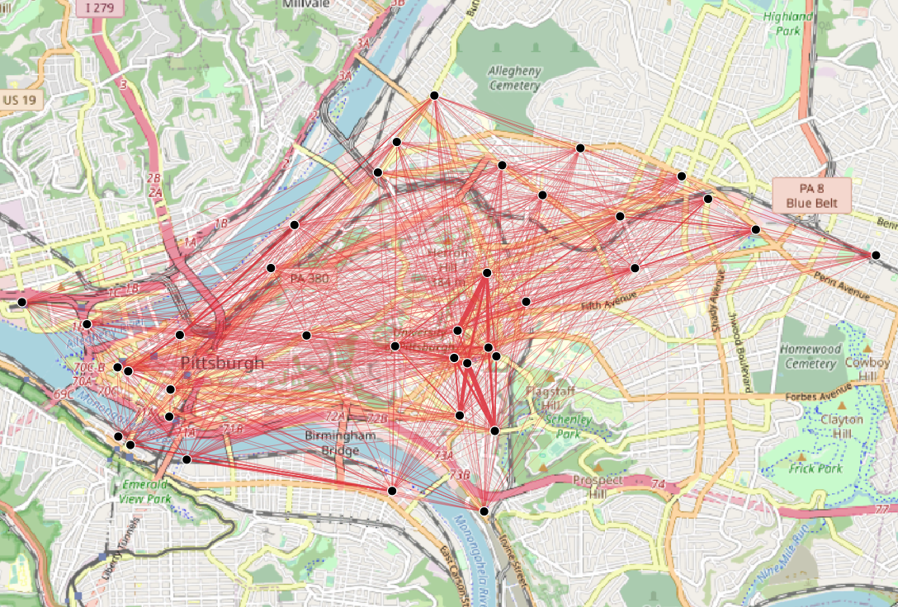
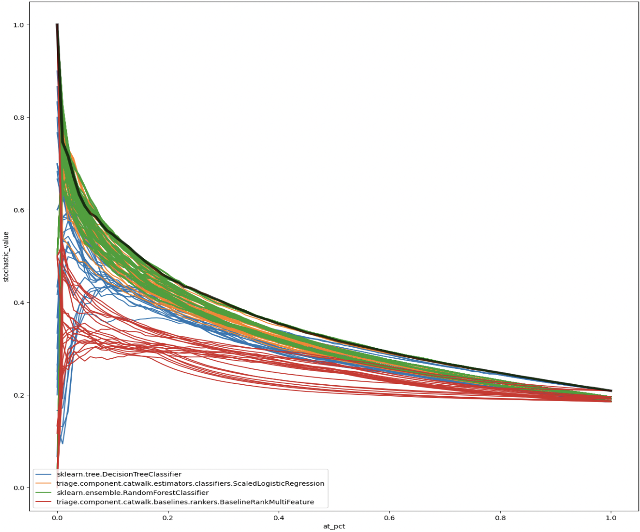
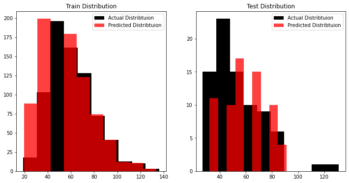

# Matt Lampl

Hi, my name is Matt. I am a second year student at Carnegie Mellon University's Heinz College studying the interesection of Public Policy and Data Analytics.

---
## Projects

### Project 1: Transportation Equity, Mobility Justice, and Bikesharing in Pittsburgh
Use Data Science and Statistical Models to propose a network expansion for the bikesharing network with a focus on equity.  
  
[Midpoint Presentation](/assets/Midterm_Presentation.pdf)

### Project 2: Decreasing the Risk of Reincarceration by Proactively Providing Mental Health Services
Developed a Machine Learning model that identifies those most at risk of reincarceration to proactively offer mental health services  
  
[Report](/assets/MLPP_Final_Report.pdf)  
[Presentation](/assets/MCRT3_Presentation.pdf)

### Project 3: Spot the Bot - Developing a Twitter Bot Detection Algorithm
Defined as automated accounts that can post, like, retweet, and follow other users, social bots have become a major concern for social media platforms and their users. As technology advances, it has become increasingly difficult for social media users to discern content generated by bots from content generated by humans. In turn, this can make it more difficult for users to critically evaluate bot-generated content, increasing the potential for misinformation.

[Report](/assets/Spot_the_Bot__-_Intro_to_AI_final_proj.pdf)
[Presentation](/assets/AI%20presentation.pdf)

### Project 4: To Bee or Not to Bee
To what extent do factors such as the usage of various pesticides, rainfall, temperature, and more impact the number of honeybee colonies as well as honey yield? In modeling honeybee colony decline, can we effectively predict and simulate honeybee production in a given state and/or region?  
  
[Report](/assets/bees_knees_report.pdf)  
[Presentation](/assets/bees_knees_presentation.pdf)  
[Repository](https://github.com/mattlampl/bees_knees)

### Project 5: Healthy Food Priority Areas Dashboard
A dashboard built using R Shiny that shows where the City of Pittsburgh should focus its efforts in fighting food insecurity.  
  
[Link to Dashboard](https://mattlampl.shinyapps.io/PGH-HFPA-Dashboard/)  
[Repository](https://github.com/mattlampl/Heatlhy-Food-Priority-Areas-Dashboard)

---
## Functional Data Science Skills
- Data cleaning and preprocessing
- Exploratory data analysis
- Data visualization
- Machine learning
- Deep learning
- Natural language processing
- Time series analysis
- Data storytelling and communication

## Languages and Technologies
**`Python`**: `pandas`, `numpy`, `scikit-learn`, `tensorflow`, `pytorch`, `spacy`, `gurobi`, `matplotlib`, `seaborn`, `geopandas`  
**`R`**: `ggplot`, `dplyr`, `tidyrverse`, `R Shiny`  
**`SQL`**: `Oracle`, `Postgres`, `MySQL`  
**`GIS`**: `ArcGIS`, `QGIS`  
**`Data Visualization Tools`**: `Tableau`, `PowerBI`  
**`Other`**: `Microsoft Excel`, `git`

---
## Eductation
MSPPM Data Analytics,  
Carnegie Mellon University, 2023 

BS Information Sciences and Technology,  
Pennsylvania State University, 2017
